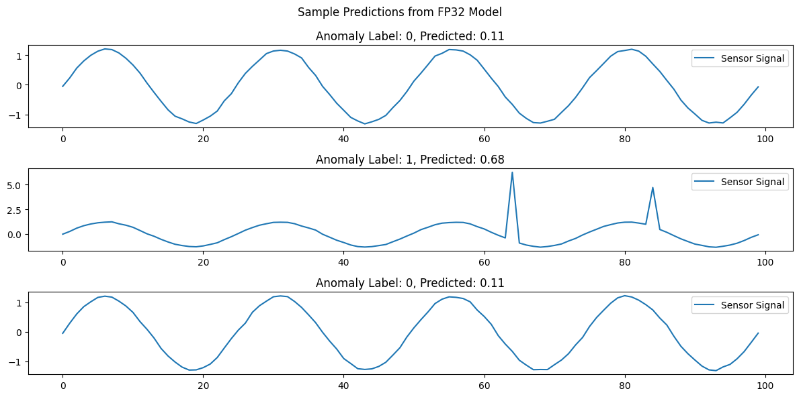

# LSTM for anomaly detetion
This example creates an LSTM in Tensorflow for the purpose of detecting anomalies in time series data.
The model is trained with sinusoidal data plus noise (normal case). Random spikes are added to generate data anomalies.
The trained model is then saved, quantized to int8 and converted to .tflite format.

Finally, inference is run with the original fp32 model and the quantized .tflite model to determine the difference in accuracy.

## Setup
```
python3.12 -m venv py3.12
. py3.12/bin/activate
pip install -r requirements.txt
```

## Run

### Python Script
The following script executes the steps described above:
`python lstm_tflite_quantized_int8.py`

It should print something like this:
```
## Loading or creating the LSTM model...
No existing model found. A new model will be created.
Epoch 1/20
88/88 ━━━━━━━━━━━━━━━━━━━━ 14s 123ms/step - accuracy: 0.6983 - loss: 0.6554 - val_accuracy: 0.6800 - val_loss: 0.5170
Epoch 2/20
88/88 ━━━━━━━━━━━━━━━━━━━━ 10s 117ms/step - accuracy: 0.6930 - loss: 0.5764 - val_accuracy: 0.6800 - val_loss: 0.5205
Epoch 3/20
88/88 ━━━━━━━━━━━━━━━━━━━━ 10s 114ms/step - accuracy: 0.6991 - loss: 0.5448 - val_accuracy: 0.7333 - val_loss: 0.4555
Epoch 4/20
88/88 ━━━━━━━━━━━━━━━━━━━━ 11s 123ms/step - accuracy: 0.7160 - loss: 0.5279 - val_accuracy: 0.8267 - val_loss: 0.4068
Epoch 5/20
88/88 ━━━━━━━━━━━━━━━━━━━━ 11s 126ms/step - accuracy: 0.7878 - loss: 0.5050 - val_accuracy: 0.9200 - val_loss: 0.3103
Epoch 6/20
88/88 ━━━━━━━━━━━━━━━━━━━━ 12s 138ms/step - accuracy: 0.7546 - loss: 0.5285 - val_accuracy: 0.8467 - val_loss: 0.4459
Epoch 7/20
88/88 ━━━━━━━━━━━━━━━━━━━━ 11s 124ms/step - accuracy: 0.7730 - loss: 0.5276 - val_accuracy: 0.8467 - val_loss: 0.3819
Epoch 8/20
88/88 ━━━━━━━━━━━━━━━━━━━━ 11s 120ms/step - accuracy: 0.8309 - loss: 0.4317 - val_accuracy: 0.9800 - val_loss: 0.2133
Epoch 9/20
88/88 ━━━━━━━━━━━━━━━━━━━━ 10s 119ms/step - accuracy: 0.7119 - loss: 0.5423 - val_accuracy: 0.8667 - val_loss: 0.3424
Epoch 10/20
88/88 ━━━━━━━━━━━━━━━━━━━━ 12s 133ms/step - accuracy: 0.8535 - loss: 0.3844 - val_accuracy: 0.8667 - val_loss: 0.3464
Epoch 11/20
88/88 ━━━━━━━━━━━━━━━━━━━━ 12s 132ms/step - accuracy: 0.8579 - loss: 0.3782 - val_accuracy: 0.9067 - val_loss: 0.2872
Training complete. Saving the model as  lstm_model_fp32.keras

## Evaluating the model on test data
150/150 ━━━━━━━━━━━━━━━━━━━━ 4s 24ms/step - accuracy: 0.9754 - loss: 0.2171
FP32 Test Accuracy from evaluate: 0.98000002, Loss: 0.19973721
150/150 ━━━━━━━━━━━━━━━━━━━━ 4s 22ms/step  
FP32 Model Test Accuracy from predict: 0.98000000

## Quantize and convert to the TFLite format
fully_quantize: 0, inference_type: 6, input_inference_type: INT8, output_inference_type: INT8
INT8-quantized model saved as lstm_model_int8_quantized.tflite

## Evaluating the INT8 TFLite model
INFO: Created TensorFlow Lite XNNPACK delegate for CPU.
INT8 Quantized Model Test Accuracy: 0.98000000

## Comparing accuracy of FP32 and INT8 models
FP32 Test Accuracy: 0.98000002
INT8 Quantized Model Test Accuracy: 0.98000000
Difference in accuracy: 0.00000002
Hyperparameters: UNROLL=False, FEATURES=1, SEQ_LEN=100, TRAINING_BATCH_SIZE=8, INFERENCE_BATCH_SIZE=1, NUM_SAMPLES=1000, HIDDEN_UNITS=32
```

### Jupyter Notebook

The notebook [lstm_anomaly_detection_train_quantize_tflite.ipynb](./lstm_anomaly_detection_train_quantize_tflite.ipynb) is provided as executable documentation with inline visualisations.

It produces a visualisation of predictions including anomalies:


*Note*: The notebook is generated directly from [lstm_anomaly_detection_train_quantize_tflite.py](./lstm_anomaly_detection_train_quantize_tflite.py) using the command ` jupytext lstm_anomaly_detection_train_quantize_tflite.py --to ipynb`

## Performance

The following table compares the measured mean inference time for different Hyperparameter combinations.
This was measured on Ubuntu 20.04.6 with tensorflow 2.19.0 on AMD Ryzen 7 PRO 5850U CPU running at 1.90 GHz

| SEQ_LEN | Unrolled | Inference time (ms) |
|---------|----------|----------------------|
| 10      | False    | 0.189               |
| 10      | True     | 0.034               |
| 100     | False    | 1.47                |
| 100     | True     | 1.79                |
